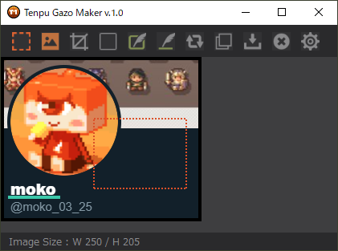

# TenpuGazoMaker
矩形範囲でスクリーンショットを撮れて、ちょっとした画像編集が可能なツールです。

**◆『Tenpu Gazo Maker』について**  
　  
　こちらが本ツールの紹介記事になります。  
　[https://effect.hatenablog.com/entry/TenpuGazoMaker](https://effect.hatenablog.com/entry/TenpuGazoMaker) 
　  
　使用時は TenpuGazoMaker_v1xx.exe を実行してください。  
　設定ファイルも同じフォルダ内に作成されます。  
　ツール上部のアイコンにカーソルを置くと説明文が表示されます。  
　  
　不具合報告は下記までお願いします。  
　https://twitter.com/moko_03_25  
　  
　  
**◆更新履歴**  
　  
　2020.03.11 ver.1.00  
　　リリースしました！  
　  
　2020.03.12 ver.1.01  
　　選択範囲やラインの描画の処理落ちを大幅に改善  
　  
　2020.03.13 ver.1.02  
　　横スクロールバーが表示されない不具合を修正  
　　ライン描画時のみアンチエイリアスを有効化  
　　Ctrl+Vでクリップボードから画像を取り込むよう変更  
　　Ctrl+Dでキャプチャ枠から背景画像を取り込むよう変更  
　　Escで設定画面を表示  
　　設定画面の表示位置とデザインを少し修正  
　　ツール下部に枠線カラーと直線カラーを表示  
　　ツールチップの説明を拡充  
　  
　2020.03.13 ver.103  
　　色設定を変えた際にツール下部のカラー表示が更新されない不具合を修正  
　  
　2020.03.14 ver.104  
　　スペースキー＋マウスドラッグによる表示画像のスクロールを追加  
　  
　2020.03.15 ver.105  
　　選択範囲の枠の描画時に角に隙間ができる不具合を修正  
　　画像上で右クリックすることでミニ設定ウインドウを表示  
　　マウスオーバーでアイコン画像を変更  
　  
　2020.03.17 ver.106  
　　ラインモード時に一度ラインを引くとカーソルが戻る不具合を修正  
　　英語/日本語の切り替え表示に対応（ツールチップとエラーメッセージ）  
　  
　2020.03.28 ver.107  
　　画像を閉じた時にサイズ表示が残る不具合を修正  
　　ライン描画モードをOFFにしてもカーソルアイコンが戻らない不具合を修正  
　  
　2020.09.20 ver.108  
　　画像の拡大縮小機能を追加  
　　何も画像が無い時に画像出力を行うとクラッシュする不具合を修正  
　　設定画面でEnterキーを押した際にビープ音を鳴らさないよう修正  
　  
　  
**◆使用アイコンについて**  
　  
　こちらのフリーアイコン素材を使用させて頂いていますが、GitHubにアップしたリソースには含まれていません。  
　『アイコン素材ダウンロードサイト「icooon-mono」』    
　　https://icooon-mono.com/  
　  
moko